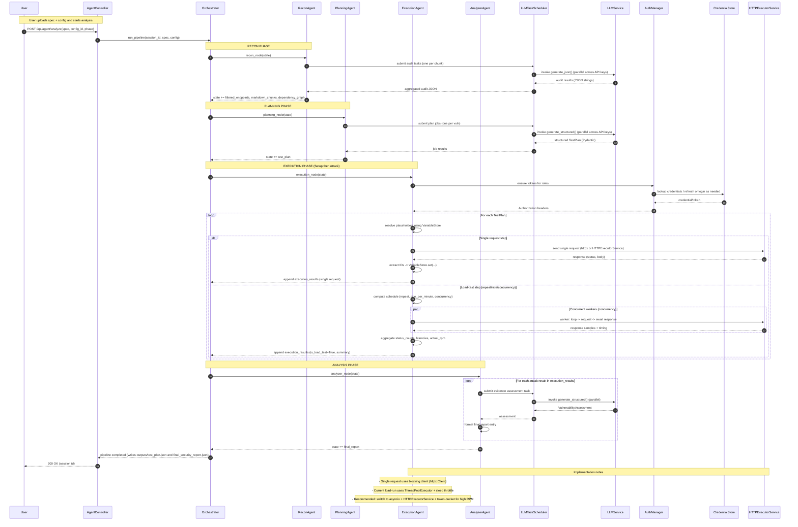

# Sequence Diagram — Full Pipeline

Below is a detailed Mermaid sequence diagram describing one full pipeline run, including load-test behavior in the `ExecutionAgent`.

```mermaid
sequenceDiagram
    autonumber
    participant User
    participant Frontend as AgentController
    participant Orchestrator
    participant Recon as ReconAgent
    participant Planning as PlanningAgent
    participant Execution as ExecutionAgent
    participant Analyzer as AnalyzerAgent
    participant LLMSched as LLMTaskScheduler
    participant LLM as LLMService
    participant Auth as AuthManager
    participant Store as CredentialStore
    participant HTTPExec as HTTPExecutorService

    Note over User,Frontend: User uploads spec + config and starts analysis
    User->>Frontend: POST /api/agent/analyze(spec, config_id, phase)
    Frontend->>Orchestrator: run_pipeline(session_id, spec, config)

    Note over Orchestrator,Recon: RECON PHASE
    Orchestrator->>Recon: recon_node(state)
    Recon->>LLMSched: submit audit tasks (one per chunk)
    LLMSched->>LLM: invoke generate_json() (parallel across API keys)
    LLM-->>LLMSched: audit results (JSON strings)
    LLMSched-->>Recon: aggregated audit JSON
    Recon-->>Orchestrator: state += filtered_endpoints, markdown_chunks, dependency_graph

    Note over Orchestrator,Planning: PLANNING PHASE
    Orchestrator->>Planning: planning_node(state)
    Planning->>LLMSched: submit plan jobs (one per vuln)
    LLMSched->>LLM: invoke generate_structured() (parallel across API keys)
    LLM-->>LLMSched: structured TestPlan (Pydantic)
    LLMSched-->>Planning: job results
    Planning-->>Orchestrator: state += test_plan

    Note over Orchestrator,Execution: EXECUTION PHASE (Setup then Attack)
    Orchestrator->>Execution: execution_node(state)

    Execution->>Auth: ensure tokens for roles
    Auth->>Store: lookup credentials / refresh or login as needed
    Store-->>Auth: credential/token
    Auth-->>Execution: Authorization headers

    loop For each TestPlan
        Execution->>Execution: resolve placeholders using VariableStore
        alt Single request step
            Execution->>HTTPExec: send single request (httpx or HTTPExecutorService)
            HTTPExec-->>Execution: response (status, body)
            Execution->>Execution: extract IDs -> VariableStore.set(...)
            Execution-->>Orchestrator: append execution_results (single request)
        else Load-test step (repeat/rate/concurrency)
            Execution->>Execution: compute schedule (repeat, rate_per_minute, concurrency)
            par Concurrent workers (concurrency)
                Execution->>HTTPExec: worker: loop -> request -> await response
                HTTPExec-->>Execution: response samples + timing
            end
            Execution->>Execution: aggregate status_counts, latencies, actual_rpm
            Execution-->>Orchestrator: append execution_results (is_load_test=True, summary)
        end
    end

    Note over Orchestrator,Analyzer: ANALYSIS PHASE
    Orchestrator->>Analyzer: analyzer_node(state)

    loop For each attack result in execution_results
        Analyzer->>LLMSched: submit evidence assessment task
        LLMSched->>LLM: invoke generate_structured() (parallel)
        LLM-->>LLMSched: VulnerabilityAssessment
        LLMSched-->>Analyzer: assessment
        Analyzer->>Analyzer: format final report entry
    end

    Analyzer-->>Orchestrator: state += final_report
    Orchestrator-->>Frontend: pipeline completed (writes outputs/test_plan.json and final_security_report.json)
    Frontend-->>User: 200 OK (session id)

    Note over Execution,HTTPExec: Implementation notes
    Note over Execution: - Single request uses blocking client (httpx.Client)
    Note over Execution: - Current load-run uses ThreadPoolExecutor + sleep throttle
    Note over Execution: - Recommended: switch to asyncio + HTTPExecutorService + token-bucket for high RPM
```
